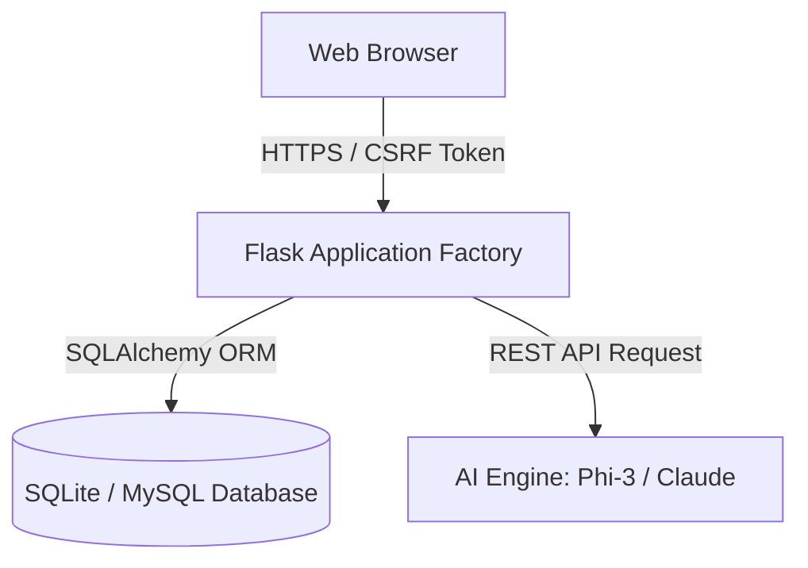

# System Architecture & Data Flow

This document details the software architecture, database design, and data processing pathways of the **GTU-ITR R&D & IIC Portal**, emphasizing security boundaries and DPDP 2023 compliance.

## 1. Architectural Overview

The portal is designed using the **Flask Application Factory Pattern** to enable scalability, configuration decoupling, and isolated testing.

- **Backend**: Python / Flask (3.1.1)
- **Database Layer**: SQLAlchemy ORM with Flask-Migrate (Alembic) migrations. Supports SQLite for local dev and MySQL/PostgreSQL for production.
- **Frontend**: Mobile-first responsive HTML5/CSS3 templates styled with GTU branding, using vanilla JavaScript for interactions and CDN packages (Chart.js, Lucide).
- **AI Services**: API service layer (Phi-3 / Anthropic Claude Integration) calling remote APIs asynchronously via AJAX.

## 2. Model Structure (ER Schema)
The database structure isolates personal details and maps them to academic records through restricted foreign keys:

- **User**: Authentication details, full name, email, phone, role enum (`PRINCIPAL`, `CHAIRPERSON`, `RD_COORDINATOR`, `DEPT_COORDINATOR`, `FACULTY`, `STUDENT_REP`), and department reference.
- **Department**: Academic departments (CE, IT, ME, EC, EE, CIV).
- **PrincipalPost**: Action notices and activities shared by the Principal, containing dates, source, assigned lead faculty, and many-to-many allocations to departments.
- **StudentRegistration**: Student name, enrollment number, email, phone, semester, department, and custom JSON answers. Referenced to a specific `PrincipalPost`.
- **ActivityReport**: Activity summary, outcome parameters, participant logs, and attachment paths uploaded by faculty and reviewed by the Principal.

## 3. Data Protection & Processing Safeguards (DPDP Act, 2023)
To ensure compliance with data protection laws:
- **Minimal Data Collection**: Student registration forms collect only parameters needed for certificates and reporting (names, emails, enrollment).
- **Isolation of Student PII**: Student registrations are saved under a separate database table (`student_registrations`) referenced only to the activity post, minimizing cross-referencing.
- **Access Bounds**:
  - Faculty can view registrations only for activities assigned to them.
  - Department Coordinators can view registrations within their department.
  - Higher authorities (Principal / Chairperson) hold portal-wide review permissions.
- **Session Tokens**: Handled via Flask-Login. Sessions are stored server-side and identified on the client-side using `HttpOnly`, `SameSite=Lax`, and `Secure` cookies.
