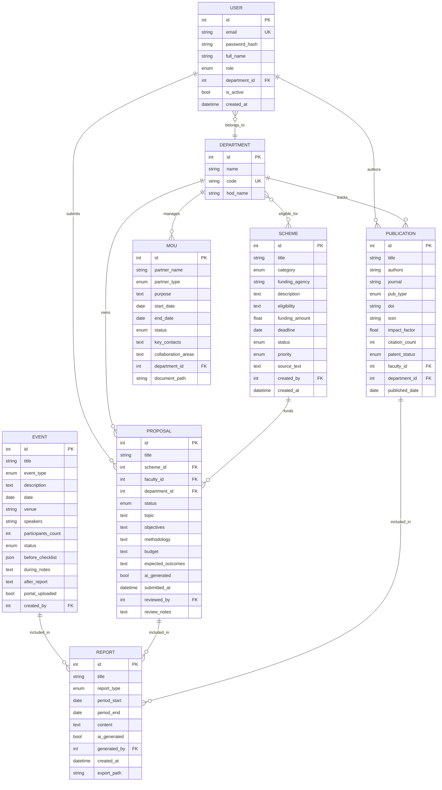

# GTU-ITR R&D & IIC Portal — Implementation Plan

> Full-stack Flask portal for managing R&D schemes, proposals, IIC events, publications, MoUs, reports, and AI-powered tools.

---

## User Review Required

> [!IMPORTANT]
> **Claude API Key**: The AI modules require an Anthropic API key. You'll need to provide this in a `.env` file or `config.py`. The app will function without it (AI features will show a configuration prompt), but AI modules won't work until the key is set.

> [!IMPORTANT]
> **Email Configuration**: Automated notifications (SMTP) require email server credentials. The app will work without them, but email alerts and the email drafter's "send" feature will be disabled.

> [!WARNING]
> **Initial Admin Setup**: On first launch, a default admin user (R&D Coordinator) will be seeded. You should change the password immediately.

## Open Questions

1. **GTU Branding**: Do you have specific GTU logos, brand colors (hex codes), or fonts you'd like to use? I'll default to GTU's official blue (`#003366`) and gold (`#FFD700`) palette if not provided.
2. **Claude API Model**: Should I use `claude-sonnet-4-20250514` (faster, cheaper) or `claude-opus-4-20250514` (more capable)? I'll default to Sonnet for all 4 AI modules.
3. **Authentication**: Should the portal support SSO/LDAP for GTU accounts, or just local username/password login for now?
4. **Deployment Target**: Will this run locally, on a college server, or cloud (Heroku/Railway/etc.)? This affects config but not architecture.
5. **IIC Portal Sync**: The "IIC Portal Sync" automation — is this syncing with MHRD's IIC portal (iic.mic.gov.in), or an internal system?

---

## Proposed Changes

The project will be built in **5 phases**, with each phase delivering a working increment. The entire codebase lives in `c:\Users\sahil\OneDrive\Desktop\iic cell\`.

---

### Phase 1: Foundation & Core Infrastructure

Sets up the Flask app skeleton, database models, authentication, and base templates.

#### [NEW] [app.py](file:///c:/Users/sahil/OneDrive/Desktop/iic cell/app.py)
- Flask app factory pattern with `create_app()`
- Register all Blueprints, initialize extensions (SQLAlchemy, Login, Mail, CSRF)
- Error handlers (404, 403, 500) with custom templates
- CLI commands: `flask seed-db` to create sample data

#### [NEW] [config.py](file:///c:/Users/sahil/OneDrive/Desktop/iic cell/config.py)
- `Config` base class with common settings
- `DevelopmentConfig` (SQLite, debug=True)
- `ProductionConfig` (PostgreSQL, debug=False)
- Environment variable loading from `.env`
- Keys: `SECRET_KEY`, `ANTHROPIC_API_KEY`, `MAIL_*` settings

#### [NEW] [requirements.txt](file:///c:/Users/sahil/OneDrive/Desktop/iic cell/requirements.txt)
```
Flask==3.1.1
Flask-SQLAlchemy==3.1.1
Flask-Login==0.6.3
Flask-WTF==1.2.2
Flask-Mail==0.10.0
Flask-Migrate==4.1.0
SQLAlchemy==2.0.41
anthropic==0.52.0
reportlab==4.4.0
openpyxl==3.1.5
python-dotenv==1.1.0
Werkzeug==3.1.3
WTForms==3.2.1
gunicorn==23.0.0
```

#### [NEW] [.env.example](file:///c:/Users/sahil/OneDrive/Desktop/iic cell/.env.example)
- Template for environment variables (no real secrets)

---

### Phase 2: Database Models

All models use SQLAlchemy ORM with proper relationships, cascades, and indexes.

#### [NEW] [models/__init__.py](file:///c:/Users/sahil/OneDrive/Desktop/iic cell/models/__init__.py)
- Exports `db` (SQLAlchemy instance) and all model classes

#### [NEW] [models/user.py](file:///c:/Users/sahil/OneDrive/Desktop/iic cell/models/user.py)
- `User` model with Flask-Login's `UserMixin`
- Fields: `id`, `email`, `password_hash`, `full_name`, `role` (enum), `department_id`, `is_active`, `created_at`
- Roles enum: `PRINCIPAL`, `CHAIRPERSON`, `RD_COORDINATOR`, `DEPT_COORDINATOR`, `FACULTY`, `STUDENT_REP`
- Password hashing via Werkzeug
- Relationships: `department`, `proposals`, `publications`

#### [NEW] [models/department.py](file:///c:/Users/sahil/OneDrive/Desktop/iic cell/models/department.py)
- `Department` model: `id`, `name`, `code`, `hod_name`
- Relationships: `users`, `schemes`, `proposals`

#### [NEW] [models/scheme.py](file:///c:/Users/sahil/OneDrive/Desktop/iic cell/models/scheme.py)
- `Scheme` model: `id`, `title`, `category` (enum: GOVERNMENT/INDUSTRY/INTERNAL/INTERNATIONAL), `funding_agency`, `description`, `eligibility`, `funding_amount`, `deadline`, `status` (enum: OPEN/APPLIED/SANCTIONED/COMPLETED/EXPIRED), `priority` (HIGH/MEDIUM/LOW), `eligible_departments` (M2M), `source_text`, `created_by`, `created_at`
- Table: `scheme_department` for M2M relationship

#### [NEW] [models/proposal.py](file:///c:/Users/sahil/OneDrive/Desktop/iic cell/models/proposal.py)
- `Proposal` model: `id`, `title`, `scheme_id` (FK), `faculty_id` (FK), `department_id` (FK), `status` (DRAFT/SUBMITTED/UNDER_REVIEW/APPROVED/REJECTED/FUNDED), `topic`, `objectives`, `methodology`, `budget`, `expected_outcomes`, `ai_generated` (bool), `submitted_at`, `reviewed_by`, `review_notes`

#### [NEW] [models/publication.py](file:///c:/Users/sahil/OneDrive/Desktop/iic cell/models/publication.py)
- `Publication` model: `id`, `title`, `authors`, `journal`, `pub_type` (JOURNAL/CONFERENCE/BOOK_CHAPTER/PATENT), `doi`, `issn`, `impact_factor`, `citation_count`, `patent_status` (FILED/PUBLISHED/GRANTED — nullable), `faculty_id`, `department_id`, `published_date`

#### [NEW] [models/event.py](file:///c:/Users/sahil/OneDrive/Desktop/iic cell/models/event.py)
- `Event` model: `id`, `title`, `event_type` (WORKSHOP/SEMINAR/HACKATHON/BOOTCAMP/LECTURE/COMPETITION), `description`, `date`, `venue`, `speakers`, `participants_count`, `status` (PLANNED/ONGOING/COMPLETED), `before_checklist` (JSON), `during_notes`, `after_report`, `portal_uploaded` (bool), `created_by`

#### [NEW] [models/mou.py](file:///c:/Users/sahil/OneDrive/Desktop/iic cell/models/mou.py)
- `MoU` model: `id`, `partner_name`, `partner_type` (INDUSTRY/ACADEMIC/GOVERNMENT/NGO), `purpose`, `start_date`, `end_date`, `status` (DRAFT/ACTIVE/EXPIRED/RENEWED), `key_contacts`, `collaboration_areas`, `department_id`, `document_path`

#### [NEW] [models/report.py](file:///c:/Users/sahil/OneDrive/Desktop/iic cell/models/report.py)
- `Report` model: `id`, `title`, `report_type` (MONTHLY/QUARTERLY/ANNUAL), `period_start`, `period_end`, `content` (text), `ai_generated` (bool), `generated_by`, `created_at`, `export_path`

---

### Phase 3: Routes & Business Logic

All routes organized as Flask Blueprints with proper access control decorators.

#### [NEW] [routes/__init__.py](file:///c:/Users/sahil/OneDrive/Desktop/iic cell/routes/__init__.py)
- Registers all blueprints

#### [NEW] [routes/auth.py](file:///c:/Users/sahil/OneDrive/Desktop/iic cell/routes/auth.py)
- Login/logout/register routes
- `@login_required` decorator usage
- Custom `@role_required(roles)` decorator for RBAC
- Session management

#### [NEW] [routes/dashboard.py](file:///c:/Users/sahil/OneDrive/Desktop/iic cell/routes/dashboard.py)
- `/` — Main dashboard with:
  - KPI cards (total schemes, active proposals, upcoming events, publications count)
  - Activity feed (recent actions across all modules)
  - Upcoming deadlines widget
  - Charts (proposals by status, schemes by category, publications trend)
- Role-based dashboard filtering

#### [NEW] [routes/schemes.py](file:///c:/Users/sahil/OneDrive/Desktop/iic cell/routes/schemes.py)
- `/schemes/` — List all schemes with filters (category, status, deadline)
- `/schemes/add` — Create new scheme (manual or AI-classified)
- `/schemes/<id>` — View scheme details
- `/schemes/<id>/edit` — Edit scheme
- `/schemes/<id>/delete` — Delete scheme
- Status pipeline visualization (Kanban-style)

#### [NEW] [routes/proposals.py](file:///c:/Users/sahil/OneDrive/Desktop/iic cell/routes/proposals.py)
- `/proposals/` — List proposals (filtered by role/department)
- `/proposals/new` — Submit new proposal
- `/proposals/<id>` — View with review actions
- `/proposals/<id>/approve` / `/reject` — Chairperson/Principal actions
- `/proposals/<id>/export-pdf` — Export as PDF

#### [NEW] [routes/iic.py](file:///c:/Users/sahil/OneDrive/Desktop/iic cell/routes/iic.py)
- `/events/` — Event calendar view + list
- `/events/new` — Create event with checklist workflow
- `/events/<id>` — Event details (before/during/after tabs)
- `/events/<id>/upload` — Mark portal upload status

#### [NEW] [routes/publications.py](file:///c:/Users/sahil/OneDrive/Desktop/iic cell/routes/publications.py)
- `/publications/` — List with type filters
- `/publications/add` — Add new publication/patent
- `/publications/<id>` — Details view with citation info
- Patent status tracker

#### [NEW] [routes/industry.py](file:///c:/Users/sahil/OneDrive/Desktop/iic cell/routes/industry.py)
- `/mous/` — MoU list with lifecycle status
- `/mous/new` — Create MoU entry
- `/mous/<id>` — Details, renewal actions
- Collaboration timeline view

#### [NEW] [routes/reports.py](file:///c:/Users/sahil/OneDrive/Desktop/iic cell/routes/reports.py)
- `/reports/` — Report archive
- `/reports/generate` — Generate new report (manual or AI)
- `/reports/<id>/export-pdf` — PDF export via ReportLab
- `/reports/<id>/export-excel` — Excel export via openpyxl

#### [NEW] [routes/ai_tools.py](file:///c:/Users/sahil/OneDrive/Desktop/iic cell/routes/ai_tools.py)
- `/ai/classify` — Scheme classifier interface
- `/ai/email` — Email drafter interface
- `/ai/proposal` — Proposal generator interface
- `/ai/report` — Report generator interface
- All endpoints have both GET (form) and POST (process) handlers

---

### Phase 4: AI Services

Each AI module is a standalone service class that calls the Claude API.

#### [NEW] [services/__init__.py](file:///c:/Users/sahil/OneDrive/Desktop/iic cell/services/__init__.py)

#### [NEW] [services/ai_classifier.py](file:///c:/Users/sahil/OneDrive/Desktop/iic cell/services/ai_classifier.py)
- `SchemeClassifier` class
- Input: raw email/scheme text
- Output: structured JSON → `{category, eligible_departments[], deadline, funding_amount, priority, summary}`
- Claude prompt engineered for GTU context
- Auto-saves to Scheme model

#### [NEW] [services/ai_email_drafter.py](file:///c:/Users/sahil/OneDrive/Desktop/iic cell/services/ai_email_drafter.py)
- `EmailDrafter` class
- Methods: `draft_circulation_email(scheme)`, `draft_followup(faculty, scheme)`, `draft_custom(context)`
- Returns formatted email with subject, body, recipients
- One-click copy/send integration

#### [NEW] [services/ai_proposal_generator.py](file:///c:/Users/sahil/OneDrive/Desktop/iic cell/services/ai_proposal_generator.py)
- `ProposalGenerator` class
- Input: topic, department, funding_agency, faculty details
- Output: full proposal with sections (objectives, methodology, timeline, budget, outcomes)
- Returns editable markdown/HTML
- Export-ready format

#### [NEW] [services/ai_report_generator.py](file:///c:/Users/sahil/OneDrive/Desktop/iic cell/services/ai_report_generator.py)
- `ReportGenerator` class
- Pulls data from all models for given month
- Generates narrative report with sections, stats, highlights
- Formats for PDF export

#### [NEW] [services/notifications.py](file:///c:/Users/sahil/OneDrive/Desktop/iic cell/services/notifications.py)
- `NotificationService` class
- Deadline alerts (7-day warning)
- New scheme notifications to relevant departments
- Proposal status change emails
- Monthly report generation reminder

#### [NEW] [services/export.py](file:///c:/Users/sahil/OneDrive/Desktop/iic cell/services/export.py)
- `PDFExporter` — ReportLab-based PDF generation for proposals and reports
- `ExcelExporter` — openpyxl-based Excel export for scheme lists, publication data

---

### Phase 5: Frontend — Templates & Static Assets

Modern, responsive UI with GTU branding, glassmorphism effects, dark mode support, and smooth animations.

#### [NEW] [static/css/style.css](file:///c:/Users/sahil/OneDrive/Desktop/iic cell/static/css/style.css)
- **Design System**:
  - CSS custom properties for GTU colors: `--gtu-primary: #003366`, `--gtu-gold: #FFD700`, `--gtu-dark: #0a1628`, accent gradients
  - Typography: Inter/Outfit from Google Fonts
  - Spacing scale, border-radius tokens, shadow system
- **Components**: Cards, buttons, badges, modals, forms, tables, KPI widgets
- **Layout**: Sidebar navigation, responsive grid, dashboard layout
- **Effects**: Glassmorphism panels, gradient borders, hover animations, skeleton loaders
- **Dark mode**: Full dark theme via `[data-theme="dark"]`
- **Responsive**: Mobile-first with breakpoints at 768px, 1024px, 1440px

#### [NEW] [static/js/main.js](file:///c:/Users/sahil/OneDrive/Desktop/iic cell/static/js/main.js)
- Sidebar toggle & mobile menu
- Dark mode toggle with localStorage persistence
- Chart rendering (Chart.js via CDN for dashboard KPIs)
- AJAX form submissions for AI tools (with loading states)
- Toast notifications
- Copy-to-clipboard for email drafter
- Form validation helpers
- Calendar widget for events
- DataTable-style sorting/filtering for lists

#### [NEW] [templates/base.html](file:///c:/Users/sahil/OneDrive/Desktop/iic cell/templates/base.html)
- Master layout with:
  - `<head>`: Meta tags, Google Fonts, Chart.js CDN, style.css
  - Sidebar navigation with icons (using Lucide icons CDN)
  - Top bar: search, notifications bell, user avatar dropdown
  - Content area with ``
  - Flash message rendering
  - Footer
  - Script includes

#### [NEW] [templates/auth/login.html](file:///c:/Users/sahil/OneDrive/Desktop/iic cell/templates/auth/login.html)
- Branded login page with GTU logo, glassmorphism card, animated background

#### [NEW] [templates/dashboard.html](file:///c:/Users/sahil/OneDrive/Desktop/iic cell/templates/dashboard.html)
- 4 KPI cards (animated counters)
- Activity feed timeline
- Upcoming deadlines list
- 2 charts (proposals pie, publications bar)
- Quick action buttons

#### Templates for each module (following consistent patterns):

| Directory | Templates |
|---|---|
| `templates/schemes/` | `list.html`, `detail.html`, `form.html` |
| `templates/proposals/` | `list.html`, `detail.html`, `form.html` |
| `templates/iic/` | `list.html`, `detail.html`, `form.html`, `calendar.html` |
| `templates/publications/` | `list.html`, `detail.html`, `form.html` |
| `templates/industry/` | `list.html`, `detail.html`, `form.html` |
| `templates/reports/` | `list.html`, `detail.html`, `generate.html` |
| `templates/ai_tools/` | `classify.html`, `email.html`, `proposal.html`, `report.html` |

Each template features:
- Breadcrumb navigation
- Consistent form styling with validation feedback
- Empty states with illustrations
- Loading/skeleton states for AI responses
- Responsive tables with sort/filter
- Modal confirmations for destructive actions

---

## Database Schema (ER Diagram)



---

## Execution Order

| Phase | Scope | Estimated Files |
|-------|-------|-----------------|
| **1** | App skeleton, config, requirements, auth | ~6 files |
| **2** | All 8 database models + migrations | ~9 files |
| **3** | All 9 route blueprints + RBAC | ~10 files |
| **4** | 4 AI services + notifications + export | ~6 files |
| **5** | Base template + all page templates + CSS + JS | ~30+ files |

**Total**: ~60+ files

---

## Verification Plan

### Automated Tests
1. `flask db upgrade` — Verify all migrations apply cleanly
2. `flask seed-db` — Seed sample data and verify no errors
3. `flask run` — Start dev server, verify all routes return 200
4. Test each CRUD route manually via browser
5. Test AI endpoints with sample data (requires API key)

### Manual Verification
- Walk through each module's list → detail → create → edit → delete flow
- Verify role-based access (login as different roles, confirm restrictions)
- Test AI classifier with sample scheme text
- Generate and export a PDF report
- Test responsive design at mobile/tablet/desktop breakpoints
- Verify dark mode toggle works across all pages
